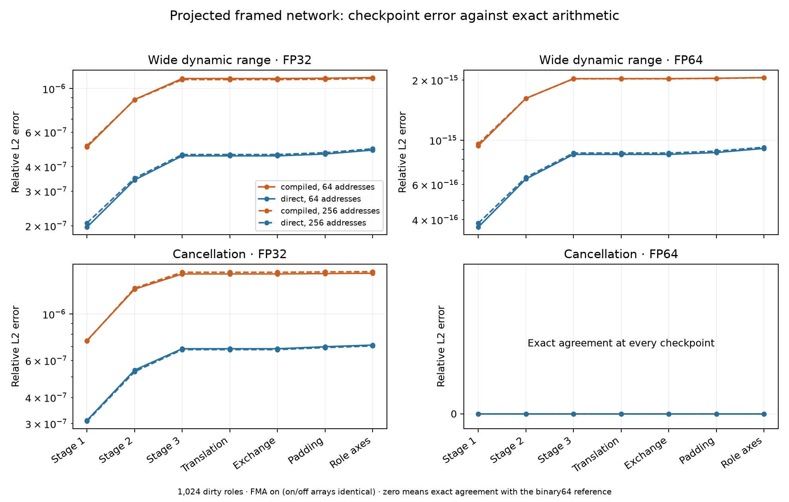

# Projected network stability experiment

The complete reduced framed network agrees with an independent target in exact
arithmetic. On len, its compiled three-C shears produced roughly 2.2–2.3 times
the final relative error of direct shears on the stress inputs. FP32 errors
were about `10^-6`; FP64 wide dynamic range errors were about `10^-15`.
This distinguishes numerical stability from validity of the exact theorem.

## What was executed

Two surjective binary maps reduced the `h=4`, one-column network's 64 address
bits to six and eight bits, with seeds 130 and 131. Each program retained all
72,842 chronological records: three framed stages, terminal corrections,
padding, and ten final role-axis layers. There were 1,024 roles, including
arbitrary data in both auxiliary and padding roles, and respectively 65,536
and 262,144 complex coordinates. This small source network has no call saving.

The [projection contract](projection-contract.md) explains the exact invariant
subspace and its target. The address target was evaluated independently using
an integer Walsh transform and the multiplier
`i^sum_j parity(images[j] AND frequency)`, followed by the role-axis transform.
Exact dyadic execution of every program record matched that target on every
coordinate of three input arrays per map. Tests also checked the actual
compiled shears against Gaussian rational arithmetic on smaller projections.
These full-array checks sample inputs; they are not exhaustive matrix certificates.

All inputs were verified exactly representable in both FP32 and FP64:

| Family | Input construction |
|---|---|
| Moderate dyadic | Independent complex components in `[-2,2]`, on a `1/8` grid |
| Wide dynamic range | Independent integer components times `2^e/8`, with `e` in `[-40,40]` |
| Cancellation | Alternating signs near `2^20`, with small independent `1/8` perturbations |

CUDA ran all combinations of three families, FP32/FP64, FMA on/off, and
compiled/direct shears: 24 cases per map, 48 total. Compiled shears executed
three forward C calls and fifteen monomial scalings, including temporary
changes to the source coordinate. Direct shears executed the same net map as
a control. Every C call used the scalar ordering exported by `Word.compile`.
Seven checkpoints retained complete output arrays.

## Observed errors

The table gives the largest final relative L2 error across the two maps and
both FMA settings, independently recomputed by subtracting retained CUDA
outputs from the binary64-rounded exact reference.

| Family | Precision | Compiled three-C shear | Direct shear |
|---|---|---:|---:|
| Moderate dyadic | FP32 | 0 | 0 |
| Moderate dyadic | FP64 | 0 | 0 |
| Wide dynamic range | FP32 | `1.139e-6` | `4.936e-7` |
| Wide dynamic range | FP64 | `2.059e-15` | `9.218e-16` |
| Cancellation | FP32 | `1.592e-6` | `7.109e-7` |
| Cancellation | FP64 | 0 | 0 |

Zeros were confirmed by direct array equality. References are rounded to
binary64 for numerical comparison; exact source/target equality and hashes
were checked before that conversion. Absolute errors depend on input scale:
the largest FP32 componentwise complex error was about `9.05` for cancellation
and `9.47e5` for the wide dynamic range family.



Errors accumulated mainly during the three framed stages. Auxiliary-coordinate
errors were already present after stage one. For the six-bit cancellation
case, their relative L2 error rose from `7.49e-7` to `1.36e-6` with compiled
shears, versus `3.35e-7` to `6.31e-7` with direct shears. Terminal translations
and signed bank exchange preserved the overall error norm.

Compiled shears also increased intermediate magnitudes: the largest finite
component was `7.47e13` on wide dynamic range inputs, versus `3.85e12` for
direct shears, and `1.36e8` versus `1.89e7` on cancellation inputs. No NaN or
infinity events occurred. These observations are consistent with additional
rounding and cancellation in the compiled word; they do not establish an
asymptotic error bound.

FMA on/off arrays were identical at every checkpoint and at the output in all
24 paired comparisons. Here the complex scalings use signs and powers of two;
the remaining non-dyadic scalings are purely real. Without overflow or
underflow, contraction has little rounding to remove in this ordering.
Other kernels and input regimes could behave differently.

## Lean verification and interpretation

The original existence theorem remains kernel checked with the unchanged 51
upstream modules. Eleven new theorems prove pullback/translation identities,
directional inversion, pointwise lifting, chronological word intertwining,
frame telescoping, and the eight-row dirty-auxiliary identity and bank exchange.
Their axiom closures contain only `propext`, `Classical.choice`, and `Quot.sound`.
The [Lean receipt](../verification/projected-stability/lean-projection.json)
binds the checked sources and toolchain.

These are algebraic proofs over exact mathematical structures. Floating-point
rounding in CUDA cannot explain a false positive in those identities. The
proofs do not yet certify the Python combinatorial frame construction, its
complete saving witness, or its count against Lean's circuit definition.

The projection preserves the exact operator on a restricted subspace, but
collapses some directions to identities and changes physical pair orientation.
It therefore measures this reduced implementation's stability. It does not
reproduce every rounding operation of the astronomical saving word or execute
the full Toeplitz-to-DFT pipeline. Stability and practicality at the saving
dimension remain open.

The next decisive proof task is to formalize the specific GF(2) frame identities
and connect their compiled word/counts to the Lean theorem. The next numerical
task is to increase construction height and search for inputs that maximize
compiled-shear source-restoration error, with explicit resource limits.

## Reproduction and retained evidence

```sh
.venv/bin/python -m pip install -e '.[research]'
.venv/bin/python scripts/make-projected-fixture.py --bits 6 --seed 130 \
  --output outputs/projected-stability/bits6
.venv/bin/python scripts/make-projected-fixture.py --bits 8 --seed 131 \
  --output outputs/projected-stability/bits8
# On a CUDA host with CuPy installed, for each bits directory:
python scripts/check-projected-cuda.py --program bits6/program.json \
  --fixture bits6/fixture.npz --output-prefix bits6/gpu/sweep --timeout 180
./scripts/verify-projection.sh
# After copying complete GPU outputs and controller receipts into outputs/:
OPENBLAS_NUM_THREADS=1 .venv/bin/python scripts/analyze-projected-stability.py
```

Execution used len's RTX4090, CuPy 13.3.0, NumPy 2.2.6, CUDA runtime 12.6,
and driver API version 13.3. Local reference generation used NumPy 2.5.3.
The controllers completed in 63.9 and 120.8 seconds, with all children reaped.
These timings include startup and output recording and are not performance
benchmarks. Existing GPU services remained running.

Receipts, per-case metrics, hashes, and the independent analysis are in
[verification/projected-stability](../verification/projected-stability).
Raw inputs, outputs, checkpoints, and the executed runner snapshot are retained
locally in `outputs/projected-stability/`, which is ignored by Git. The plot is
also available as [PDF](assets/projected-stability.pdf).

The first attempt failed before GPU execution because NVRTC could not find
`math.h`; it was retained and the diagnostic counters were made header-free.
Review later exposed a metric that could hide a one-ULP difference by scaling
before subtraction. The evaluator's metric was corrected with a regression
test; all 48 existing raw outputs were independently rechecked. That correction
did not change CUDA arithmetic or the recorded conclusions.
